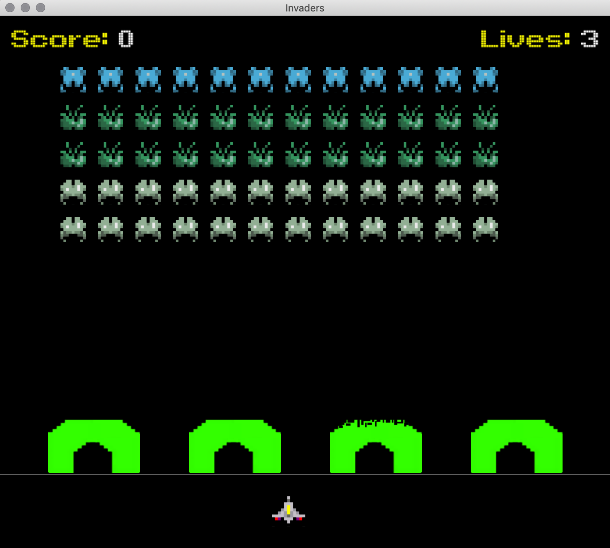

# space-invader


<!-- PROJECT LOGO -->
<br />
<p align="center">
    <a href="https://github.com/howuvebeen/space-invader"></a>
</p>

<a href="https://github.com/howuvebeen/space-invader"><h2 align="center">Space Invader</h2></a>

<p align="center">
<strong>Built a classic shooting game using stateful controllers to program features like defense barriers, multiple waves, sound effects, increasing speed, and score tracking using Python.</strong>
<br />
<br />
<code>Python</code>
·
<code>Arcade Shooting Game</code>
</p>


<!-- TABLE OF CONTENTS -->
# Table of Contents

* [About the Project](#about-the-project)
  * [Built With](#built-with)
  * [Game Rules](#game-rules)
  * [Game Features](#game-features)
  * [Game States](#game-state)
  * [Extensions](#extensions)
* [Getting Started](#getting-started)
  * [Prerequisites](#prerequisites)
  * [Running the Game](#running-the-game)
* [Code](#code)
  * [Find Phase](#find-phase)
  * [Flee Phase](#flee-phase)
* [License](#license)


<!-- ABOUT THE PROJECT -->
# About The Project

This is the final project I've done for **CS 1100**, Introduction to Computing Using Python. I received 100 out of 100. 

The Pacxon version is one of the the most authentic Space Invader games. 

## Built With

* Python

## Game Rules

Win
* The last alien is destoryed

Lost
* The ship is destroyed and there are no lives remaining.
* Any alien touches the defensive line.

## Game Features

Aliens
* The aliens are arranged in rows and columns.
* They march back and forth across the screen, increasing speed as time goes.
* An alien chosen at random fires laser bolts. 
* They die when they collide with the laser bolt shot by the ship.

* At the bottom of the screen, there is a defense line.
* The ship can move horizontally and shoot a laser bolt at the aliens to attack. 

## Game States

* STATE_INACTIVE: Before the game starts, and the alien wave has not started
* STATE_NEWWAVE: When the aliens are set up, but have not started to move
* STATE_ACTIVE: While the game is ongoing, and the aliens are on the march
* STATE_PAUSED: While the game is paused (e.g. to show a message)
* STATE_CONTINUE: While the game is creating a new ship to replace the old one
* STATE_COMPLETE: After the game is over

## Extensions

* intro animation
* multiple waves
* implement sound effects
* dynamically speed up the aliens
* keep track of score
* animate the aliens
* defense barriers


<!-- GETTING STARTED -->
# Getting Started

These instructions will get you a copy of the project up and running on your local machine for development and testing purposes.


## Prerequisites

* pip
* introcs
* kivy


## Running the Game

1. Click green Code button and download the zip file from github. 
2. Direct into a folder called invaders try the command ```python invaders```


<!-- CODE -->
# Code

These are some of the codes of I built for the game. To see more, refer to **app.py**, **wave.py**, and **models.py**.


```
def _collisionDefenseBarriers(self):
    """
    Check for collision between bolt and barrier
    DefenseBarriers weeken if collide with bolt

    Parameter: None
    Precondition: None
    Return: None
    """
    if self._breakin_alien_count < ALIEN_ROWS * ALIENS_IN_ROW:
        for d in range(DEFENSE_BARRIERS_NUM):
            defense = self._defense_barriers[d]
            if defense != None:
                if self._defenseBarriers_collision_alien(defense):
                    if defense.frame < DEFENSE_BARRIERS_FRAMES:
                        defense.frame += 1
                    else:
                        del defense
                        self._defense_barriers[d] = None

    if len(self._bolts) > 0:
        for d in range(DEFENSE_BARRIERS_NUM):
            defense = self._defense_barriers[d]
            if defense != None:
                i = 0
                while i < len(self._bolts):
                    if defense.collides(self._bolts[i]):
                        del self._bolts[i]
                        if defense.frame < DEFENSE_BARRIERS_FRAMES:
                            defense.frame += 1
                        else:
                            del defense
                            self._defense_barriers[d] = None
                        break
                    else:
                        i += 1

def _defenseBarriers_collision_alien(self, defense):
    """
    Check collision between alien and defense barriers

    Parameter defense: defense is barrier object
    Precondition defense: defense is not None, type is DefenseBarriers
    Return: 'True' if alien and defense collides, 'False' if not
    """
    assert defense != None and type(defense) == DefenseBarriers

    for i in range(ALIEN_ROWS):
        for j in range(ALIENS_IN_ROW):
            alien = self._aliens[i][j]
            if alien != None and alien.live and defense.collides(alien):
                alien.live = False
                alientype = int(ALIEN_TYPE_MAP[ALIEN_ROWS-1][i])
                self._score += ALIEN_SCORE[alientype]
                self._breakin_alien_count += 1
                return True
    return False
```

```
def _bolt_collision_alien(self, bolt):
        """
        Check for collision between player's bolt and alien

        Parameter bolt: Bolt object
        Precondition bolt: bolt is not None, type is Bolt,
            bolt is bolt fired by ship
        Return: 'True' if bolt and aline collide, 'False' if not
        """
        assert bolt != None and type(bolt) == Bolt and bolt.isPlayerBolt()

        for i in range(ALIEN_ROWS):
            for j in range(ALIENS_IN_ROW):
                alien = self._aliens[i][j]
                if alien != None and alien.collides(bolt):
                    alien.live = False
                    alientype = int(ALIEN_TYPE_MAP[ALIEN_ROWS-1][i])
                    self._score += ALIEN_SCORE[alientype]
                    self._breakin_alien_count += 1
                    return True
        return False

    def _bolt_collision_ship(self, bolt):
        """
        Check for collision between alien bolt and ship

        Parameter bolt: Bolt object
        Precondition bolt: bolt is not None, type is Bolt,
            bolt is bolt fired by alien
        Return: 'True' if bolt and aline collide, 'False' if not
        """
        assert bolt != None and not bolt.isPlayerBolt()

        if self._ship != None and self._ship.collides(bolt):
            return True
        return False
```


<!-- LICENSE -->
# License

- Yubin Heo
- cs1110-2018fall
